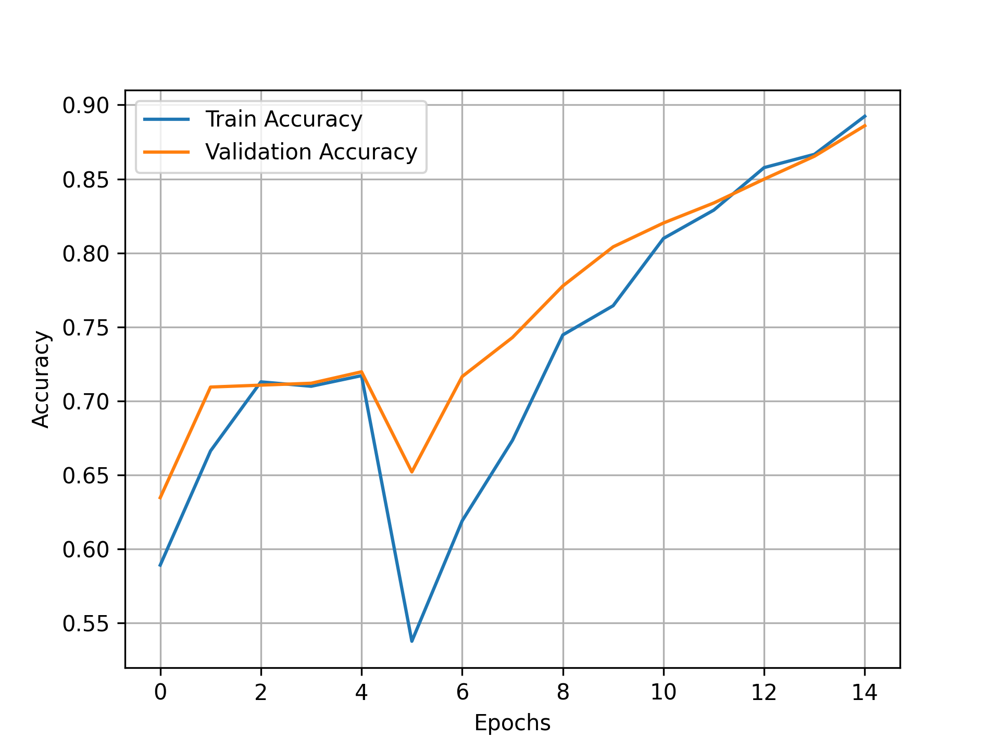
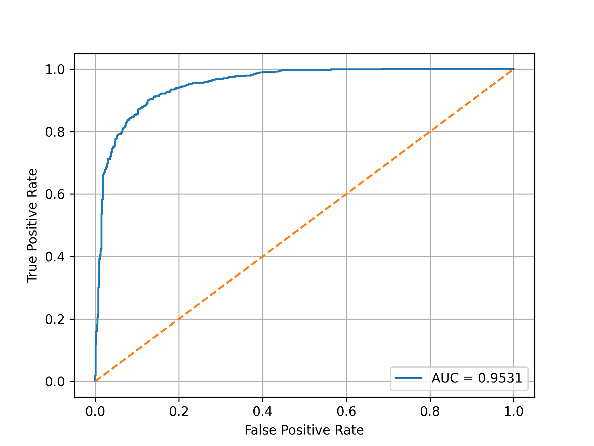
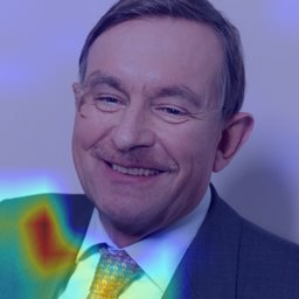

# Deepfake Image Detector

A high-accuracy deepfake detection system using fine-tuned Xception CNN with visual explainability.

**Accuracy: 88.6% | AUC: 0.9531 | Model: Xception**

## Quick Start

# Clone & install
git clone https://github.com/sarael302/deepfake-detector
cd deepfake-detector
pip install -r requirements.txt

# Start API
python app/inference_api.py

# Open web interface: test.html in browser

## Features

- **88.6% Accuracy** on validation set
- **Grad-CAM Visualizations** for model explainability
- **Real-time API** with FastAPI backend
- **Two-phase training**: Warm-up + Fine-tuning
- **Web Interface** for easy testing
- **Dataset utilities** for preprocessing

## Performance

### Model Results
| Metric | Value |
|--------|-------|
| Validation Accuracy | 88.6% |
| AUC-ROC | 0.9531 |
| Precision (Real) | 90.2% |
| Recall (Real) | 86.9% |
| Inference Speed | ~45ms/image |

### Visualizations
| Accuracy/Loss | ROC Curve | Grad-CAM Real | Grad-CAM Fake |
|---------------|-----------|-------------------|-------------------|
|  |  |  |  |

## Architecture

**Model:** Fine-tuned Xception (ImageNet pretrained)  
**Input:** 299×299×3 RGB images  
**Training:** Two-phase transfer learning  
**Parameters:** 21.4M total, 524K trainable  
**Head:** GlobalAvgPool → Dense(256) → Dropout → Sigmoid

┌─────────┐     ┌─────────────┐     ┌─────────────┐
│  Image  │ ──▶ │ Preprocess  │ ──▶ │  Xception   │
└─────────┘     └─────────────┘     └─────────────┘
                                              │
┌─────────┐     ┌─────────────┐     ┌─────────────┐
│  Web UI │ ◀──▶ │  FastAPI   │ ◀─── │ Prediction │
└─────────┘     └─────────────┘     └─────────────┘
                                              │
                                      ┌─────────────┐
                                      │  Grad-CAM   │
                                      └─────────────┘
                                      
Project Structure

DEEPFAKE-DETECTOR/
├── app/inference_api.py          # FastAPI server
├── src/train_xception.py         # Training pipeline
├── src/gradcam_xception.py       # Visual explanations
├── dataset/                      # Real/Fake images
├── figures/                      # Results & plots
├── test.html                     # Web interface
├── best_xception.h5              # Trained model
└── requirements.txt              # Dependencies

## Usage

### 1. Start API

python app/inference_api.py
# API runs at http://127.0.0.1:8000

### 2. Use Web Interface
1. Open `test.html` in browser
2. Upload image (JPG/PNG)
3. Get instant prediction with confidence

### 3. API Endpoints

# Health check
curl http://127.0.0.1:8000/

# Predict endpoint
curl -X POST -F "file=@image.jpg" http://127.0.0.1:8000/predict
# Response: {"label": "Real/Fake", "confidence": 0.92}

### 4. Train Your Own Model

python src/train_xception.py --data_dir dataset_tiny/

## Training Strategy

**Phase 1 (Warm-up):** Frozen backbone, train only classification head (5 epochs)  
**Phase 2 (Fine-tuning):** Unfreeze last 40 layers, train with lower LR (10 epochs)  
**Data Augmentation:** Rotation, flip, brightness, zoom, shear

## Requirements

tensorflow>=2.12
opencv-python
numpy
fastapi
uvicorn
matplotlib
scikit-learn
pillow

## License

MIT License - see [LICENSE](LICENSE) file.

## Authors

**Sara El Mendili & Hadil Baticha**  
Department of Computer Engineering and Networks, EMSI Rabat, Morocco

